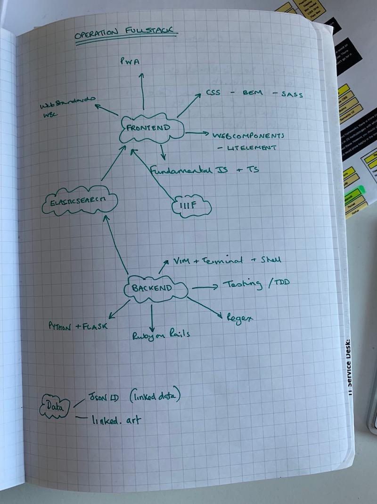

Whatapalaver's 100DaysOfCode Log - Round 4
===

I've been in my first developer role for about a month and it's clear to me that I am going to have to take my journey to "hot shot professional coder" as seriously as I took the bootcamp experience. I can't afford to drift through the experience and instead need a defined developer's development plan to work through. Something like this [fine roadmap](https://github.com/kamranahmedse/developer-roadmap).

So, with that in mind it's time to kick start Round 4 of 100daysofcode to document the progress and keep me accountable.
My previous accountability rounds are till available here:

- [Round 3](https://github.com/Whatapalaver/100_Days_of_Code/blob/master/r3-log.md) documented the 70 days post Makers graduation where I consolidated the bootcamp experience, completed a stack of technical tests and finally secured myself a couple of job offers before accepting a fullstack role at The V&A.
- [Round 2](https://github.com/Whatapalaver/100_Days_of_Code/blob/master/r2-log.md) covered the 99 days of my Makers bootcamp experience. From the pre-course to graduation day.
- [Round 1](https://github.com/Whatapalaver/100_Days_of_Code/blob/master/r2-log.md) This was my initial foray into 100 Days of Code.

R4D6
--

I was juggling between vanilla JS with CSS and Elasticsearch today. I started the Wes Bos 30 day challenge last night as I'm aware that I have leapt over the basic 'manipulating the DOM with vanilla JS' stage of my learning. Today I was therefore making a little drumkit for the browser, moderately jazzed up with css grid.
I also worked on Reactivesearch experimenting with the very beta implementation of support for nested fields. I had some significant excitement as I fathomed out now end of bugs and glitches and really felt a lightbulb moment as the momentous power of chrome inspector was revealed to me.

I wrote an abstract for a potential lightening talk at a German IIIF conference later in the year. Here's hoping its not accepted.

R4D5
---

So it's back to ElasticSearch today, this time trying to bring in the V&A objects data into my experiment with the Reactivesearch frontend. I've ended the day with some cool visuals of the ceramics collection using the resultcard component, I do however have a gazillion new issues to resolve! Our ES data is riddled with nested fields and the release of ReactiveSearch that I had been using doesn't support it. I've since upgraded to the version 3 beta which appears to have some form of support implemented although not seemingly documented. That will be the fun task for tomorrow.

In addition of learned 

- some css tricks about increasing specificity to override some weird styling imported in one of my npm packages.
- managed to debug a volume mount between my local machine and Docker which should mean I can work on this on my home machine

R4D4
---

Ben (from Makers) very kindly offered to review my manifest-pdf script over the weekend and he gave me some excellent pointers. Today I had the opportunity to work through some improvements which involved a bit of class extraction, improving the structure of my CLI, adding a config file option so you don't have to pass a gazillion flags in the run command and a general tidying up of my initialise method. I just need to retrofit some much needed tests!

R4D3 Monday 25th
---

Struggling with Elasticsearch again today, dabbling with some frontend integrations but finally having some success with Reactsearch which provides React components to work with an elasticsearch instance. I was able to mock up a dummy interface with some high level facets and added some uber cool illustrations courtesy of robohash.org . I need to explore nested fields next.

R4D2
---

I wanted to practice with some end to end elasticsearch work. I've been working on aggregations and nested queries but all within kibana. I feel the need to work it through with a full application to try and seal some gaping holes in my conceptualisation. I thought it would be great to kill two birds with one stone and work this through in python....
Hours lost.
To fathoming out virtualenv and then virtualenvwrapper and then trying to fix $PATH errors and blah blah.
Bottom line is that I got no further than an extremely rudimentary Hello World in flask. No where near elasticsearch at all.

R4D1 - The development plan unveiled
---

In my first month at the museum I've worked across a variety of projects. Working on tickets that fix features on the CMS (a Ruby on Rails application), created a mini executable that translates a IIIF manifest into a customisable pdf document, becoming a leading expert on regex (cough), panicked myself with ssh commands and explored elasticsearch in depth.

There is just so much that I don't know and what I do know, I know I don't really know. There is plenty of opportunity for performance anxiety.

Here's my initial attampt at a pathway to Fullstack competence with a heavy nod to the fact that I'm in a museum - hence the IIIF and Elasticsearch focus.

